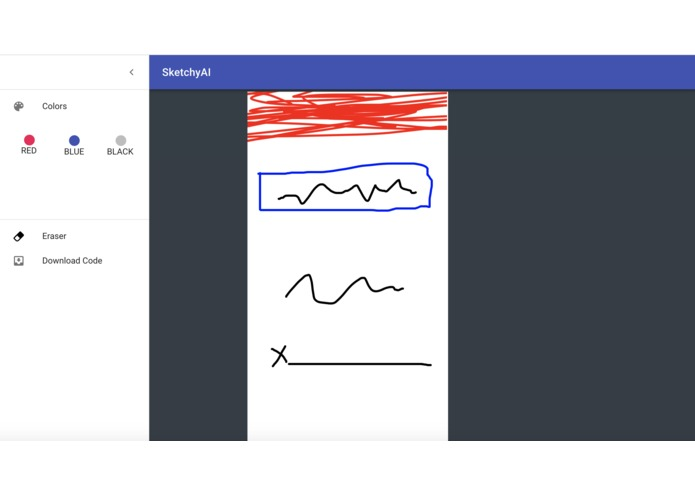

# SketchyAI
Go from Zero to Hero with SketchyAI. Build Beautiful Mobile Applications with only your Sketches.

Watch it working [here](https://www.linkedin.com/posts/phodonou_vandyhacks-cool-futureisnow-activity-6465127723957387264-ELu2)

## Inspiration
We wanted to build something that could relieve the pain of building applications for beginners and more experienced users. This could potentially help those with no coding experience build apps and those with coding experience would be able to save time in development.

## What it does
The piece of software is able to turn a simple UI drawing into an entire mobile application.

## How we built it
- React.js (build the drawing environment)
- YOLO (a machine learning CNN algorithm)
- Google Cloud Computer Engine
- Flutter
- Flask
- Firebase

